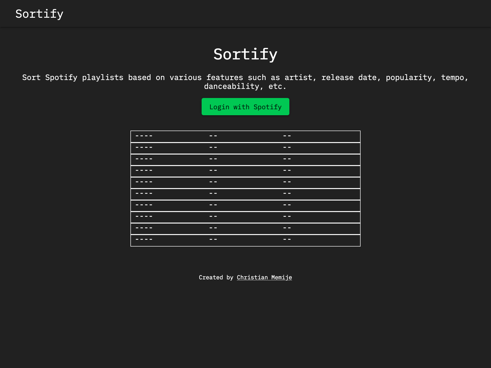
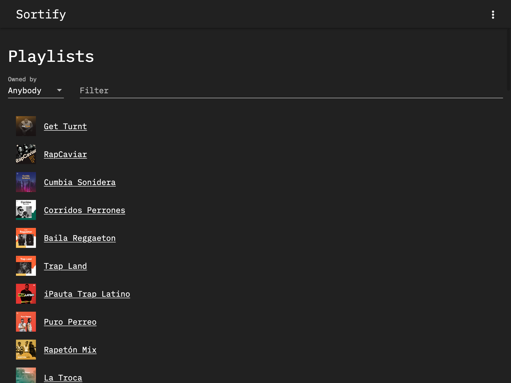
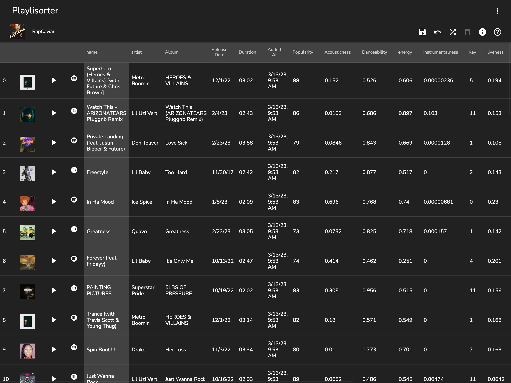
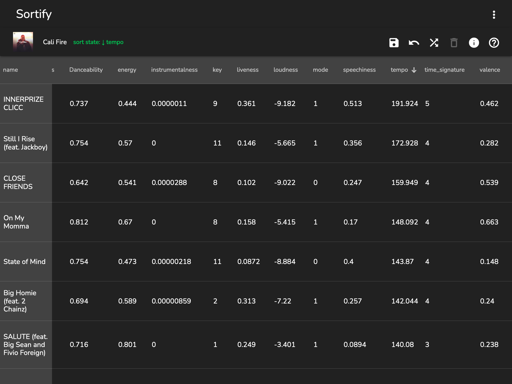
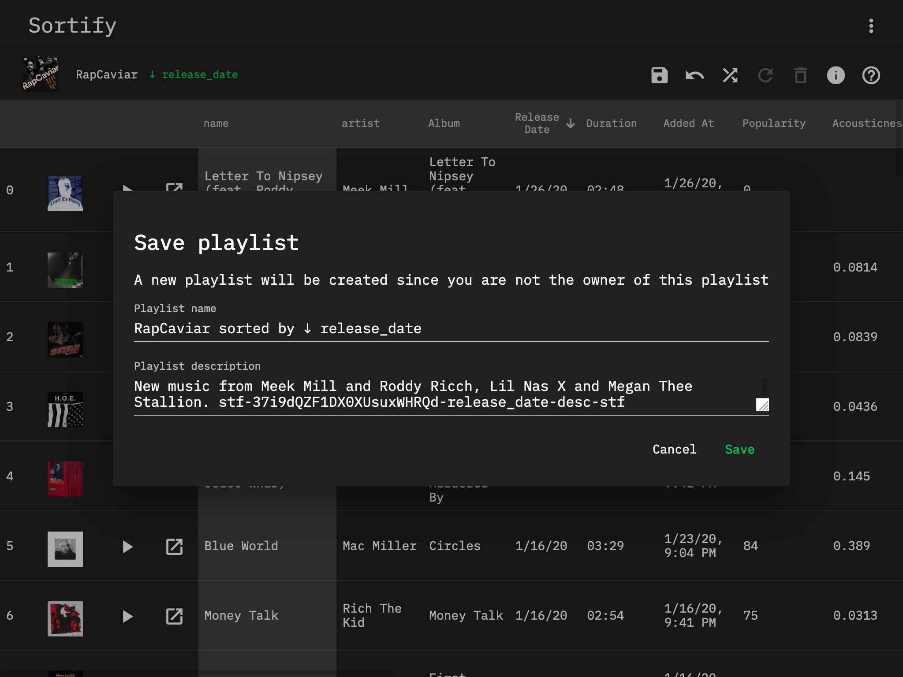

# Sortify

> Sort Spotify playlists based on various features such as artist, release date, popularity, tempo, danceability, etc.

[https://sortspotifyplaylists.com](https://sortspotifyplaylists.com)

## Features

- Sort Spotify playlists by all sorts of attributes:
  - name, artist, album, release date, duration, added date, popularity, danceability, energy, instrumentalness, key, liveness, loudness, mode, speechiness, tempo, time signature, valence
- Save the new playlist order by overwriting the playlist or creating a new playlist
- 100% client-side, so no data is collected
- Preview tracks

## Screenshots

## Usage

### Save

- There are 2 options:
  - Overwrite - Overwrites the current playlist, only possible if you own the playlist.
  - Create new - Creates a new playlist.

### Reset

Resets the order of the playlist to the order it had when the page was loaded, does not save until you press save.

### Shuffle

Randomizes the order of the playlist, does not save until you press save.

### Delete

Only possible if you own the playlist

### Info

View playlist details including title, description, owner, etc. Allows you to open the playlist within Spotify.

### Help

View this documentation
