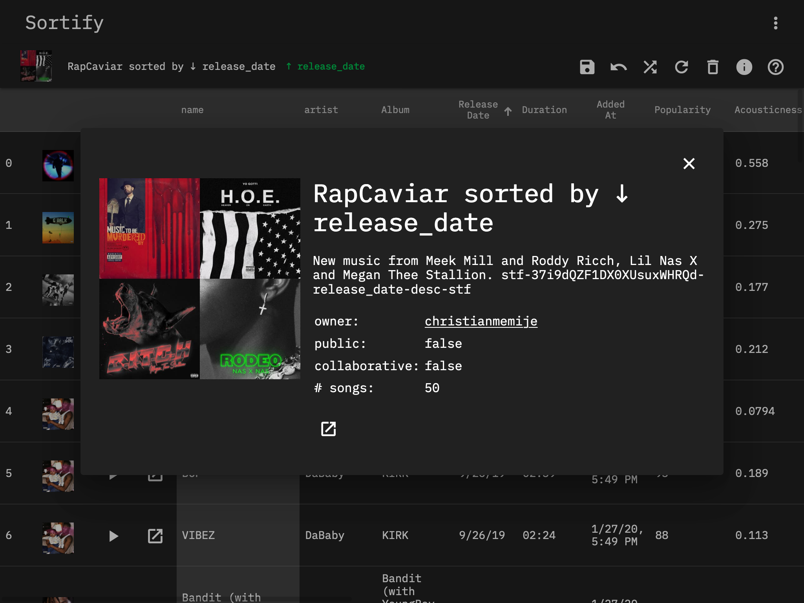

# Sortify

> Sort Spotify playlists based on various features such as artist, release date, popularity, tempo, danceability, etc.

https://sortspotifyplaylists.com/

## Features

- Sort Spotify playlists by all sorts of attributes:
  - name, artist, album, release date, duration, added date, popularity, danceability, energy, instrumentalness, key, liveness, loudness, mode, speechiness, tempo, time signature, valence
- Save the new playlist order by overwriting the playlist or creating a new playlist
- 100% client-side, so no data is collected
- Preview tracks

## Screenshots

## Usage

### Save

- There are 2 options:
  - Overwrite - Overwrites the current playlist, only possible if you own the playlist.
  - Create new - Creates a new playlist.
- Allows the encoding of playlist & sort state within the description as `stf-PLAYLIST_ID_SORT_KEY_DIRECTION-stf`. This is useful for the Refresh feature which allows keeping a playlist in sync with another one.

### Reset

Resets the order of the playlist to the order it had when the page was loaded, does not save until you press save.

### Shuffle

Randomizes the order of the playlist, does not save until you press save.

### Refresh

If the playlist's description contains the playlist & sort state encoded (e.g. `stf-PLAYLIST_ID_SORT_KEY_DIRECTION-stf`), which is done upon save, this will pull the playlist the current playlist was based off of, and apply the sorting. Does not save until you press save. This is useful for keeping a playlist in sync with the one it is based off of while keeping sorting order

### Delete

Only possible if you own the playlist

### Info

View playlist details including title, description, owner, etc. Allows you to open the playlist within Spotify.

### Help

View this documentation
